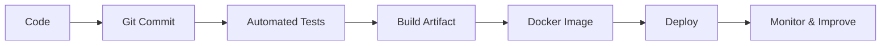

<div align="center">


[](https://git.io/typing-svg)

[](https://github.com/zhanpeng001)
[](https://github.com/zhanpeng001?tab=followers)

</div>

---

## About Me

I'm **Zhanpeng**, also known as **Justin**. I build full-stack applications with a practical engineering mindset: clean layers, maintainable code, automated workflows, and deployments that are repeatable instead of manual.

My current focus is growing deeper in **CI/CD, DevOps, automation, AI integration, and production-ready full-stack systems**.

```txt
Frontend      Vue | TypeScript | JavaScript | Vite
Backend       Go | Python | Java
Database      MySQL | SQLite | Oracle
DevOps        GitHub Actions | Docker | Linux | CI/CD pipelines
Architecture  Layered design | API-first development | Automation
```

---

## Tech Arsenal

<div align="center">

### Frontend


### Backend


### Database


### CI/CD & DevOps


</div>

---

## CI/CD Mindset

I care about building software that can move from code to production with confidence.



What I focus on:

- **Automated quality checks** before code reaches production.
- **Repeatable builds** so deployments are consistent across environments.
- **Pipeline-first thinking** with GitHub Actions and scripted workflows.
- **Container-ready applications** using Docker-friendly project structures.
- **Clean architecture** so testing and deployment are easier to maintain.

---

## What I'm Building Toward

<table>
  <tr>
    <td width="50%">
      <h3>Full-Stack Systems</h3>
      <p>Vue interfaces connected to Go or Python APIs, backed by clear database models and maintainable service layers.</p>
    </td>
    <td width="50%">
      <h3>Automation Tools</h3>
      <p>Scripts, workflows, and utilities that remove repetitive manual work from development and deployment.</p>
    </td>
  </tr>
  <tr>
    <td width="50%">
      <h3>CI/CD Workflows</h3>
      <p>GitHub Actions pipelines for testing, building, packaging, and deployment preparation.</p>
    </td>
    <td width="50%">
      <h3>AI Integration</h3>
      <p>Practical AI features inside web applications, developer tools, and productivity workflows.</p>
    </td>
  </tr>
</table>

---

## GitHub Activity

<div align="center">


</div>

---

## Current Focus

- Building stronger **CI/CD pipelines** with automated testing and repeatable deployments.
- Improving backend systems with **Go, Python, clean APIs, and layered architecture**.
- Creating polished frontend experiences with **Vue, TypeScript, and Vite**.
- Learning how to integrate **AI and automation** into practical developer workflows.

---

## Connect With Me

<div align="center">

[](https://github.com/zhanpeng001)

</div>

---

<div align="center">


**"Good code is not just about what works. It is about what lasts, ships, and keeps improving."**

</div>
